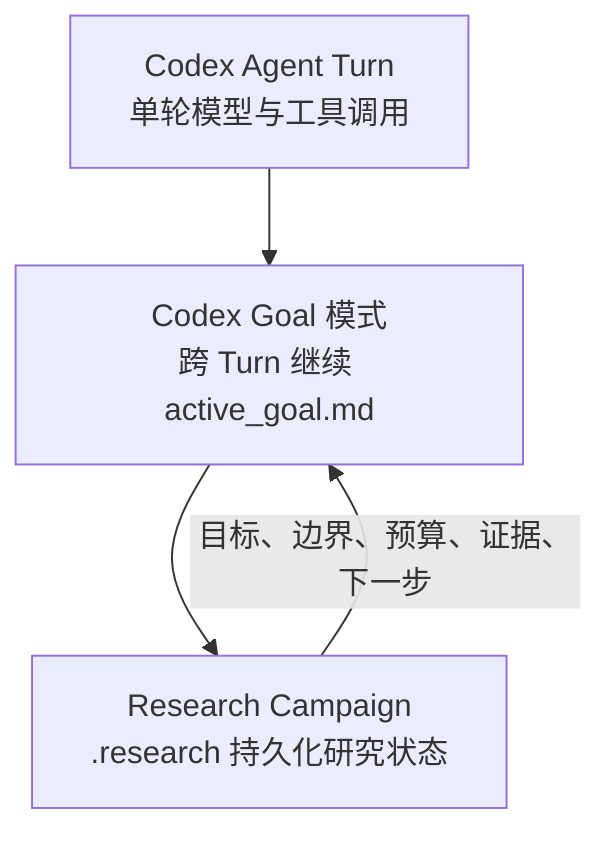
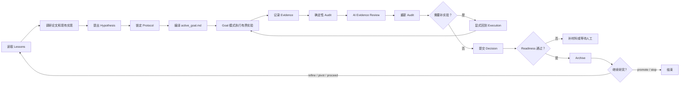

先澄清一下：下面讲的是刚提交到 `feature/loop-engineering-redesign` 的新方案。它尚未合并到 `master`，也没有重新安装到 Codex 插件缓存，所以当前 Codex 实际加载的版本不一定已经是这套。

一句话概括：它现在是一套“有状态、有预算、可审计、人工可接管”的研究闭环，而不是靠 Stop Hook 不断催促模型继续运行。

## 三层循环



职责划分是：

- Codex Agent Turn：执行具体命令、读取结果、推理。
- Codex Goal 模式：负责跨 turn 继续工作。
- AutoResearch Guard：维护研究轮次、协议、证据、审计、预算、决策和归档。

因此，插件本身不是 daemon，也不是后台 runner。它更像研究流程的“控制面”。具体边界记录在[循环契约](/home/ssy/桌面/autoresearch-guard.worktrees/loop-engineering-redesign/autoresearch-guard/skills/autoresearch-guard/references/loop_contract.md:11)。

## 一轮研究怎么运行



具体分为六步。

### 1. 初始化研究轮次

`arx_init.py` 创建：

```text
.research/
├── current/       当前 iteration
├── lessons/       跨轮经验和反模式
└── archive/       已完成或恢复归档
```

当前 iteration 的唯一控制状态是 `current/state.yaml`。

### 2. 调研、假设和协议锁定

先填写：

- `literature_review.md`：论文、想法和现有实现。
- `hypothesis.yaml`：本轮目标、假设、prior-art 依据和复用方案。
- `protocol.lock.yaml`：数据划分、指标、门禁、baseline 和循环预算。
- `blocked_actions.yaml`：禁止执行的动作。
- `claim_boundary.yaml`：允许得出什么等级的结论。

未锁定的协议只能生成 `active_goal.draft.md`。只有人工检查后设置 `locked: true`，正式编译才会进入：

```text
execution / armed
```

### 3. Goal 模式执行有界实验

编译产生 `active_goal.md`，交给 Codex Goal 模式。目标文件明确写入：

- 本轮目标和假设
- 允许与禁止的工作
- 数据划分边界
- 验证门禁
- 循环预算
- 完成和停止条件

每次只执行一个有界实验，然后调用 `arx_record.py` 写入 evidence ledger。一次工具调用不等于一次有效实验，Post Hook 也不会自动把成功命令冒充成科研证据。

这一约定可见 [active_goal 模板](/home/ssy/桌面/autoresearch-guard.worktrees/loop-engineering-redesign/autoresearch-guard/skills/autoresearch-guard/templates/active_goal.md.j2:49)。

### 4. Audit → AI Review → 再 Audit

第一次 `arx_audit.py` 会检查：

- evidence 是否属于当前 iteration
- 协议是否被修改
- split、seed、metric 是否符合协议
- 失败记录是否被错误用于 validation gate
- baseline 是否成立
- 是否出现连续失败、指标平线或重复无效尝试
- 当前允许哪些 decision

然后 AI 填写 `ai_evidence_review.md`，将结论绑定到具体 evidence。

填写后必须再运行一次 audit，因为 AI review 本身也是审计摘要的输入。否则旧 audit 会被判为 stale。

### 5. Decision 和 Closure

`arx_decide.py` 支持：

- `promote`：当前结果值得升级。
- `refine`：保留方向，缩小或调整方案。
- `pivot`：换方向。
- `proceed`：在受控条件下继续。
- `stop`：结束研究。

Decision 提交后进入：

```text
closure / closing
```

此时 evidence 冻结，不能再补实验。若确实缺证据，必须在 decision 前显式执行：

```bash
arx_loop.py resume --reopen-execution
```

继续型决策还必须填写 `next_goal.md`，作为下一轮的明确输入。

### 6. Readiness 和归档

`arx_loop.py check` 是唯一的闭环判定入口。

只有同时满足以下条件才会返回 `ready: true`：

- 已进入 closure
- 至少有一条本轮 evidence
- protocol 仍然锁定且摘要未漂移
- audit 绑定当前 ledger、review 和协议
- decision 绑定当前 audit
- 失败经验已写入 lessons
- 继续型决策已有 `next_goal.md`

通过后才能执行 `arx_archive.py`。完整状态迁移见[工作流文档](/home/ssy/桌面/autoresearch-guard.worktrees/loop-engineering-redesign/autoresearch-guard/skills/autoresearch-guard/references/workflow.md:34)。

## 如何避免死循环

默认预算是：

- 最多 20 个 owner turn
- 最多 12 个实验 attempt
- 最多连续失败 3 次
- 指标平线最多 3 次
- 最多 2 个无进展 turn
- Stop Hook 最多纠偏 1 次
- 最长运行 240 分钟

触发后不会伪装成“完成”，而是返回明确结果：

```text
budget_exhausted
no_progress
blocked_requires_human
aborted
```

然后进入 `waiting_human`、释放 owner session、停止自动续跑。即使 Hooks 没启用，手工运行 `arx_loop.py check` 也会触发预算熔断。

## Hooks 现在只负责辅助

Hooks 默认关闭，需要初始化时传入 `--enable-hooks`，并在 Codex 中 trust。

- SessionStart：恢复时注入当前研究状态。
- PreToolUse：提前拦截 forbidden split、blocked action、锁定协议修改、错误阶段实验和非 owner 会话。
- PostToolUse：提醒检查结果并调用 `arx_record.py`，不自动记录。
- Stop：最多提供一次补救 continuation；重入直接放行，预算耗尽则强制停止。

也就是说，Hooks 只是快速反馈层，不是安全边界。即使 Hook 漏触发，最终的 record、audit、decision、readiness 和 archive 仍会重新检查。Hook 注册见 [hooks.json](/home/ssy/桌面/autoresearch-guard.worktrees/loop-engineering-redesign/autoresearch-guard/hooks/hooks.json:1)。

整体上，它现在是一套“Codex 驱动执行、脚本负责确定性状态、人工处理关键歧义”的半自动研究工作流，而不是无人值守的无限自循环系统。